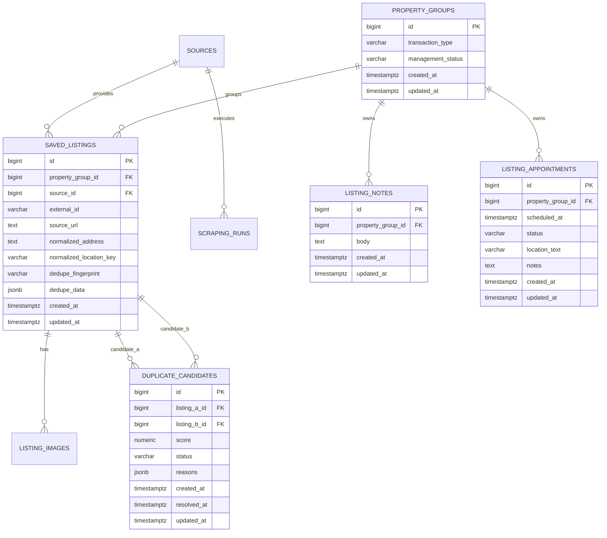

# RicercaCasa — V2 Analisi Database

**Versione documento:** 2.0  
**Data:** 14 luglio 2026  
**Branch di riferimento:** `dev-jox`  
**DBMS:** PostgreSQL  
**Versionamento schema:** `node-pg-migrate`

---

## 1. Obiettivo

La V2 deve estendere il database V1 per supportare:

1. tre fonti immobiliari;
2. più annunci sorgente riferiti allo stesso immobile reale;
3. deduplicazione cross-provider prudente e verificabile;
4. stato gestionale dell'immobile;
5. note personali;
6. appuntamenti;
7. decisioni manuali sui possibili duplicati;
8. aggiornamenti dei dati esterni senza perdita dei dati personali.

La V2 non sostituisce le tabelle V1 e non riscrive le migrazioni già condivise.

Le modifiche devono essere additive e applicabili sia a:

- database vuoto;
- database V1 già contenente preferiti.

---

## 2. Stato database V1 verificato

Tabelle presenti:

- `sources`;
- `saved_listings`;
- `listing_images`;
- `scraping_runs`;
- tabella tecnica delle migrazioni gestita da `node-pg-migrate`.

Vincoli principali:

```text
sources.code UNIQUE
saved_listings (source_id, external_id) UNIQUE
saved_listings (source_id, source_url) UNIQUE
listing_images (listing_id, image_url) UNIQUE
```

Relazioni:

```text
sources 1 ---- N saved_listings
sources 1 ---- N scraping_runs
saved_listings 1 ---- N listing_images
```

### 2.1 Limite del modello V1

`saved_listings` rappresenta contemporaneamente:

- il record acquisito dal portale;
- il preferito gestito localmente.

Con più provider questa equivalenza non è più sufficiente.

Lo stesso immobile può produrre:

```text
Immobiliare.it -> saved_listing A
Idealista      -> saved_listing B
Casa.it        -> saved_listing C
```

A, B e C devono restare record distinti perché:

- hanno ID esterni differenti;
- hanno URL differenti;
- possono avere prezzi e descrizioni differenti;
- possono essere aggiornati in momenti differenti;
- devono conservare la provenienza.

Tuttavia note, appuntamenti e stato devono esistere una sola volta.

---

## 3. Principio di modellazione V2

La V2 introduce due livelli.

### 3.1 `property_groups`

Rappresenta l'immobile logico seguito dall'utente.

Contiene esclusivamente dati gestionali e metadati del raggruppamento.

### 3.2 `saved_listings`

Continua a rappresentare la pubblicazione proveniente da un portale.

Ogni record viene collegato a un `property_group`.

### 3.3 Dati personali separati

Le nuove tabelle:

- `listing_notes`;
- `listing_appointments`;

referenziano `property_groups`, non `saved_listings`.

Questa scelta garantisce che più portali condividano lo stesso contesto gestionale.

---

## 4. Modello logico V2

Entità:

1. `sources` — provider;
2. `property_groups` — immobili logici;
3. `saved_listings` — annunci sorgente;
4. `listing_images` — immagini per annuncio sorgente;
5. `duplicate_candidates` — coppie sospette e decisioni;
6. `listing_notes` — note personali;
7. `listing_appointments` — appuntamenti;
8. `scraping_runs` — esiti tecnici.



---

## 5. Estensione `sources`

La migrazione V2 deve inserire:

```text
code: idealista_it
name: Idealista
base_url: https://www.idealista.it
active: true
```

```text
code: casa_it
name: Casa.it
base_url: https://www.casa.it
active: true
```

Il seed deve essere idempotente tramite `ON CONFLICT (code) DO NOTHING`.

Il rollback deve eliminare un provider soltanto se non è referenziato.

Non devono essere creati enum PostgreSQL per i provider: la tabella `sources` resta il catalogo estendibile.

---

## 6. Tabella `property_groups`

### 6.1 Scopo

Rappresenta un immobile reale o, più precisamente, il gruppo gestionale che RicercaCasa considera come un singolo immobile.

### 6.2 Campi

| Campo | Tipo | Null | Regole |
|---|---|---:|---|
| `id` | `BIGSERIAL` | no | PK |
| `transaction_type` | `VARCHAR(20)` | no | `rent` oppure `sale` |
| `management_status` | `VARCHAR(30)` | no | default `saved` |
| `created_at` | `TIMESTAMPTZ` | no | default `now()` |
| `updated_at` | `TIMESTAMPTZ` | no | default `now()` |

### 6.3 Check

```sql
CHECK (transaction_type IN ('rent', 'sale'))
```

```sql
CHECK (
  management_status IN (
    'saved',
    'to_contact',
    'contacted',
    'appointment_scheduled',
    'visited',
    'discarded'
  )
)
```

### 6.4 Motivazione del modello minimo

I dati immobiliari principali restano in `saved_listings`, perché ogni fonte può presentarli in modo differente.

`property_groups` non deve duplicare prezzo, descrizione o indirizzo senza una regola chiara di sincronizzazione.

Il service seleziona una fonte rappresentativa al momento della lettura.

In futuro potranno essere aggiunti override locali, ma non fanno parte della V2.

### 6.5 Indici

```sql
CREATE INDEX property_groups_status_idx
ON property_groups (management_status);
```

```sql
CREATE INDEX property_groups_updated_at_idx
ON property_groups (updated_at DESC);
```

---

## 7. Modifiche a `saved_listings`

### 7.1 Nuovi campi

| Campo | Tipo | Null iniziale | Stato finale | Note |
|---|---|---:|---:|---|
| `property_group_id` | `BIGINT` | sì | no | FK → `property_groups.id` |
| `normalized_address` | `TEXT` | sì | sì | indirizzo normalizzato |
| `normalized_location_key` | `VARCHAR(500)` | sì | sì | comune/quartiere/strada |
| `dedupe_fingerprint` | `VARCHAR(128)` | sì | sì | hash deterministico |
| `dedupe_data` | `JSONB` | no | no | default `{}` |

### 7.2 Foreign key

```sql
FOREIGN KEY (property_group_id)
REFERENCES property_groups(id)
ON DELETE RESTRICT
```

`RESTRICT` evita di cancellare accidentalmente un gruppo che contiene annunci sorgente.

L'eliminazione applicativa di un intero immobile deve essere gestita in transazione:

1. eliminare o scollegare annunci sorgente;
2. eliminare note e appuntamenti tramite cascade;
3. eliminare il gruppo.

### 7.3 `normalized_address`

Esempio:

```text
via giordano bruno 12 senigallia an
```

Regole:

- minuscolo;
- accenti rimossi;
- punteggiatura rimossa;
- spazi normalizzati;
- abbreviazioni stradali uniformate;
- civico separato e ricomposto;
- niente dati inventati.

### 7.4 `normalized_location_key`

Esempio:

```text
italia|marche|ancona|senigallia|centro|via-giordano-bruno
```

Serve a restringere il set dei candidati prima del calcolo del punteggio.

Non è una chiave univoca.

### 7.5 `dedupe_fingerprint`

Hash di un payload normalizzato stabile, quando sono disponibili informazioni sufficienti.

Esempio concettuale del payload:

```json
{
  "transactionType": "sale",
  "municipality": "senigallia",
  "street": "via giordano bruno",
  "civicNumber": "12",
  "surfaceBucket": 75,
  "rooms": 3
}
```

Regole:

- SHA-256 o hash equivalente applicativo;
- non deve contenere segreti;
- può essere `NULL` quando i dati sono insufficienti;
- non deve essere usato da solo per merge distruttivi;
- risultati uguali sono candidati, non prova assoluta.

### 7.6 `dedupe_data`

JSONB con valori normalizzati e versione algoritmo.

Esempio:

```json
{
  "version": 1,
  "municipality": "senigallia",
  "district": "centro",
  "street": "via giordano bruno",
  "civicNumber": "12",
  "surfaceM2": 75,
  "rooms": 3,
  "floor": "2",
  "propertyType": "apartment",
  "latitude": 43.7142,
  "longitude": 13.2179,
  "titleTokens": ["trilocale", "terrazzo"]
}
```

Conservare la versione permette di ricalcolare i fingerprint dopo modifiche dell'algoritmo.

### 7.7 Indici

```sql
CREATE INDEX saved_listings_property_group_id_idx
ON saved_listings (property_group_id);
```

```sql
CREATE INDEX saved_listings_normalized_location_key_idx
ON saved_listings (normalized_location_key)
WHERE normalized_location_key IS NOT NULL;
```

```sql
CREATE INDEX saved_listings_dedupe_fingerprint_idx
ON saved_listings (dedupe_fingerprint)
WHERE dedupe_fingerprint IS NOT NULL;
```

Non creare subito un indice GIN su `dedupe_data`: va aggiunto soltanto se richiesto dalle query reali.

---

## 8. Backfill dei dati V1

### 8.1 Obiettivo

Ogni `saved_listing` esistente deve ricevere un `property_group_id` senza perdere dati.

### 8.2 Strategia sicura

Per ogni record V1 senza gruppo:

1. creare un nuovo `property_group` con lo stesso `transaction_type`;
2. impostare `management_status = 'saved'`;
3. collegare il record;
4. calcolare, quando possibile, dati normalizzati e fingerprint.

In questa fase non devono essere uniti automaticamente record V1 diversi.

La deduplicazione cross-provider verrà eseguita dopo il backfill, con regole e candidati espliciti.

### 8.3 Sequenza vincolo

1. aggiungere `property_group_id` nullable;
2. eseguire backfill;
3. verificare che nessun record sia `NULL`;
4. impostare `NOT NULL`;
5. creare indice e foreign key se non già create.

### 8.4 Verifica

```sql
SELECT COUNT(*)
FROM saved_listings
WHERE property_group_id IS NULL;
```

Il risultato deve essere `0` prima del `NOT NULL`.

---

## 9. Tabella `duplicate_candidates`

### 9.1 Scopo

Registra una possibile corrispondenza tra due annunci sorgente.

Permette di:

- spiegare perché due record sono simili;
- conservare decisioni manuali;
- evitare proposte ripetute;
- distinguere merge automatici e manuali.

### 9.2 Campi

| Campo | Tipo | Null | Regole |
|---|---|---:|---|
| `id` | `BIGSERIAL` | no | PK |
| `listing_a_id` | `BIGINT` | no | FK → `saved_listings.id`, cascade |
| `listing_b_id` | `BIGINT` | no | FK → `saved_listings.id`, cascade |
| `score` | `NUMERIC(5,4)` | no | tra 0 e 1 |
| `status` | `VARCHAR(30)` | no | default `pending` |
| `reasons` | `JSONB` | no | default `[]` |
| `algorithm_version` | `INTEGER` | no | default `1` |
| `created_at` | `TIMESTAMPTZ` | no | default `now()` |
| `resolved_at` | `TIMESTAMPTZ` | sì | decisione |
| `updated_at` | `TIMESTAMPTZ` | no | default `now()` |

### 9.3 Stati

- `pending`;
- `auto_confirmed`;
- `confirmed`;
- `rejected`.

### 9.4 Vincoli

La coppia deve essere salvata in ordine crescente:

```sql
CHECK (listing_a_id < listing_b_id)
```

```sql
CHECK (score >= 0 AND score <= 1)
```

```sql
CHECK (
  status IN ('pending', 'auto_confirmed', 'confirmed', 'rejected')
)
```

```sql
UNIQUE (listing_a_id, listing_b_id)
```

Un record non può essere confrontato con sé stesso grazie al check sull'ordine.

### 9.5 Esempio `reasons`

```json
[
  { "signal": "same_normalized_address", "weight": 0.55 },
  { "signal": "surface_within_5_percent", "weight": 0.15 },
  { "signal": "same_rooms", "weight": 0.10 }
]
```

### 9.6 Indici

```sql
CREATE INDEX duplicate_candidates_status_score_idx
ON duplicate_candidates (status, score DESC);
```

```sql
CREATE INDEX duplicate_candidates_listing_a_idx
ON duplicate_candidates (listing_a_id);
```

```sql
CREATE INDEX duplicate_candidates_listing_b_idx
ON duplicate_candidates (listing_b_id);
```

---

## 10. Tabella `listing_notes`

### 10.1 Scopo

Conserva note personali relative all'immobile logico.

### 10.2 Campi

| Campo | Tipo | Null | Regole |
|---|---|---:|---|
| `id` | `BIGSERIAL` | no | PK |
| `property_group_id` | `BIGINT` | no | FK → `property_groups.id`, cascade |
| `body` | `TEXT` | no | testo nota |
| `created_at` | `TIMESTAMPTZ` | no | default `now()` |
| `updated_at` | `TIMESTAMPTZ` | no | default `now()` |

### 10.3 Vincoli

```sql
CHECK (length(btrim(body)) > 0)
```

La lunghezza massima di 10.000 caratteri viene applicata dal validator. Può essere aggiunto anche un check database:

```sql
CHECK (char_length(body) <= 10000)
```

### 10.4 Indice

```sql
CREATE INDEX listing_notes_group_created_at_idx
ON listing_notes (property_group_id, created_at DESC);
```

### 10.5 Eliminazione

`ON DELETE CASCADE` è appropriato: eliminando definitivamente l'immobile logico si eliminano le note collegate.

---

## 11. Tabella `listing_appointments`

### 11.1 Scopo

Conserva appuntamenti o visite programmati per l'immobile logico.

### 11.2 Campi

| Campo | Tipo | Null | Regole |
|---|---|---:|---|
| `id` | `BIGSERIAL` | no | PK |
| `property_group_id` | `BIGINT` | no | FK → `property_groups.id`, cascade |
| `scheduled_at` | `TIMESTAMPTZ` | no | data e ora |
| `status` | `VARCHAR(20)` | no | default `scheduled` |
| `location_text` | `VARCHAR(500)` | sì | luogo/indicazioni |
| `notes` | `TEXT` | sì | nota appuntamento |
| `created_at` | `TIMESTAMPTZ` | no | default `now()` |
| `updated_at` | `TIMESTAMPTZ` | no | default `now()` |

### 11.3 Stati

```sql
CHECK (status IN ('scheduled', 'completed', 'cancelled'))
```

### 11.4 Limiti

```sql
CHECK (location_text IS NULL OR char_length(location_text) <= 500)
```

```sql
CHECK (notes IS NULL OR char_length(notes) <= 5000)
```

### 11.5 Indici

```sql
CREATE INDEX listing_appointments_group_scheduled_at_idx
ON listing_appointments (property_group_id, scheduled_at);
```

```sql
CREATE INDEX listing_appointments_status_scheduled_at_idx
ON listing_appointments (status, scheduled_at);
```

### 11.6 Date

- salvare sempre `TIMESTAMPTZ`;
- ricevere ISO 8601 dal frontend;
- convertire nel fuso locale soltanto in presentazione;
- non salvare stringhe data formattate in italiano.

---

## 12. Relazione tra stato e appuntamenti

`property_groups.management_status` e `listing_appointments.status` sono distinti.

Esempio:

- l'immobile può essere `appointment_scheduled`;
- un vecchio appuntamento può essere `cancelled`;
- un nuovo appuntamento può essere `scheduled`.

La creazione di un appuntamento non deve modificare lo stato tramite trigger database.

La regola appartiene al service applicativo, che può:

- proporre `appointment_scheduled`;
- aggiornarlo nella stessa transazione quando richiesto dal caso d'uso.

Evitare trigger mantiene la logica leggibile nel codice.

---

## 13. Strategia di salvataggio V2

### 13.1 Nuovo annuncio senza candidati

```text
BEGIN
  1. trova source
  2. crea property_group
  3. inserisce saved_listing collegato
  4. inserisce immagini
  5. calcola e salva dedupe_data
COMMIT
```

### 13.2 Annuncio esatto già presente

```text
BEGIN
  1. trova saved_listing per source + external_id
  2. aggiorna dati esterni
  3. conserva property_group_id
  4. sostituisce immagini
  5. non modifica stato, note e appuntamenti
COMMIT
```

### 13.3 Duplicato cross-provider confermato

```text
BEGIN
  1. determina property_group di destinazione
  2. collega nuovo saved_listing allo stesso gruppo
  3. aggiorna duplicate_candidate a confirmed/auto_confirmed
  4. preserva tutte le fonti
COMMIT
```

### 13.4 Merge di due gruppi esistenti

Il merge è l'operazione più delicata.

Strategia:

```text
BEGIN
  1. blocca entrambi i property_groups FOR UPDATE
  2. sceglie gruppo destinazione deterministico
  3. sposta saved_listings
  4. sposta note
  5. sposta appuntamenti
  6. risolve candidati duplicati
  7. elimina gruppo vuoto
COMMIT
```

Gruppo destinazione consigliato:

- ID minore oppure gruppo creato prima.

### 13.5 Conflitti gestionali

Se entrambi i gruppi possiedono stato diverso:

- nessun dato deve essere perso;
- il service applica una priorità documentata oppure richiede scelta utente.

Per la V2 si propone questa priorità conservativa:

```text
appointment_scheduled
visited
contacted
to_contact
saved
discarded
```

`discarded` non deve prevalere automaticamente su un gruppo attivo.

Note e appuntamenti vengono tutti conservati.

---

## 14. Strategia di deduplicazione database

### 14.1 Candidate retrieval

Il database non calcola il punteggio completo.

Il repository recupera un insieme ridotto di candidati tramite:

- stessa operazione;
- stesso `normalized_location_key` o comune;
- fingerprint uguale;
- coordinate in un intervallo ristretto, se disponibili;
- superficie in un intervallo applicativo.

Il service calcola il punteggio finale.

### 14.2 Query iniziale indicativa

```sql
SELECT id, property_group_id, dedupe_data
FROM saved_listings
WHERE source_id <> $1
  AND transaction_type = $2
  AND (
    dedupe_fingerprint = $3
    OR normalized_location_key = $4
    OR municipality = $5
  )
LIMIT 100;
```

La query reale deve costruire condizioni soltanto per valori disponibili.

### 14.3 Nessun vincolo univoco sul fingerprint

Non creare:

```sql
UNIQUE (dedupe_fingerprint)
```

Motivo:

- più appartamenti nello stesso stabile possono avere dati simili;
- portali diversi possono omettere civico e piano;
- una collisione logica non deve impedire il salvataggio.

---

## 15. Lettura del dettaglio V2

### 15.1 Dati richiesti

Il dettaglio deve aggregare:

- `property_groups`;
- fonte rappresentativa;
- tutti i `saved_listings` del gruppo;
- immagini della fonte rappresentativa;
- note;
- appuntamenti;
- candidati duplicati pendenti.

### 15.2 Strategia query

Per leggibilità e manutenzione sono accettabili query separate coordinate dal service:

1. gruppo + listing richiesto;
2. tutte le fonti;
3. immagini;
4. note;
5. appuntamenti;
6. candidati.

Con il volume locale previsto non è necessario costruire una singola query SQL enorme con molte aggregazioni.

### 15.3 Fonte rappresentativa

Ordine suggerito:

1. listing richiesto dalla route;
2. listing con dati più completi;
3. listing aggiornato più recentemente.

La scelta deve essere deterministica.

---

## 16. Repository V2

```text
backend/models/
├── sourceRepository.js
├── propertyGroupRepository.js
├── savedListingRepository.js
├── listingImageRepository.js
├── listingNoteRepository.js
├── listingAppointmentRepository.js
├── duplicateCandidateRepository.js
└── scrapingRunRepository.js
```

### 16.1 `propertyGroupRepository`

- crea gruppo;
- recupera gruppo per listing;
- aggiorna stato;
- blocca gruppi per merge;
- elimina gruppo vuoto;
- sposta relazioni durante merge.

### 16.2 `savedListingRepository`

Estensioni:

- upsert preservando `property_group_id`;
- assegna gruppo;
- elenca fonti del gruppo;
- ricerca candidati dedupe;
- aggiorna fingerprint e dati normalizzati.

### 16.3 `listingNoteRepository`

- lista per gruppo;
- crea;
- aggiorna con controllo gruppo;
- elimina con controllo gruppo.

### 16.4 `listingAppointmentRepository`

- lista per gruppo;
- crea;
- aggiorna;
- cambia stato;
- elimina;
- seleziona prossimo appuntamento.

### 16.5 `duplicateCandidateRepository`

- upsert coppia;
- lista pendenti per gruppo;
- conferma;
- rifiuta;
- marca auto-confirmed;
- aggiorna risultato dopo ricalcolo algoritmo.

---

## 17. Piano migrazioni V2

Le migrazioni V1 `001`-`004` non devono essere modificate.

### `005_seed_additional_sources`

- inserisce Idealista;
- inserisce Casa.it;
- usa `ON CONFLICT DO NOTHING`.

### `006_create_property_groups`

- crea tabella;
- aggiunge check;
- aggiunge indici stato e aggiornamento.

### `007_add_property_group_and_dedupe_fields_to_saved_listings`

- aggiunge `property_group_id` nullable;
- aggiunge campi normalizzati;
- aggiunge `dedupe_data` con default `{}`;
- crea indici non univoci.

### `008_backfill_property_groups`

- crea un gruppo per ciascun listing esistente senza gruppo;
- collega i record;
- verifica assenza `NULL`;
- rende `property_group_id` non nullo;
- aggiunge o conferma foreign key.

Il `down` non deve eliminare gruppi se nel frattempo contengono più listing. Se un rollback sicuro non è possibile, deve fallire con messaggio esplicito anziché perdere dati.

### `009_create_duplicate_candidates`

- crea tabella;
- aggiunge vincoli;
- aggiunge indici.

### `010_create_listing_notes`

- crea tabella;
- aggiunge cascade;
- aggiunge check e indice.

### `011_create_listing_appointments`

- crea tabella;
- aggiunge cascade;
- aggiunge check e indici.

### Migrazione opzionale successiva

`012_compute_existing_dedupe_fields` può essere uno script applicativo o migrazione controllata.

Non deve effettuare merge automatici durante la migrazione.

---

## 18. Regole di aggiornamento `saved_listings`

Campi esterni aggiornabili:

- URL;
- titolo;
- descrizione;
- prezzo;
- caratteristiche;
- posizione;
- immagini;
- inserzionista;
- `raw_data`;
- date fonte;
- `last_scraped_at`;
- dati dedupe.

Campi da preservare:

- `id`;
- `property_group_id`;
- `source_id`;
- `external_id`;
- `saved_at`;
- `first_scraped_at`;
- `created_at`.

Tabelle mai modificate dall'upsert del provider:

- `listing_notes`;
- `listing_appointments`;
- stato di `property_groups`.

---

## 19. Eliminazione

### 19.1 Eliminare una fonte

Quando un gruppo contiene più annunci sorgente, l'utente può rimuovere una singola fonte senza eliminare l'immobile logico.

Flusso:

1. elimina `saved_listing`;
2. immagini eliminate con cascade;
3. candidati relativi eliminati con cascade;
4. se il gruppo resta senza fonti, chiedere conferma prima di eliminare gruppo, note e appuntamenti.

### 19.2 Eliminare l'immobile locale

Operazione esplicita:

```text
BEGIN
  DELETE saved_listings del gruppo
  DELETE property_group
COMMIT
```

Note e appuntamenti vengono eliminati tramite cascade.

L'interfaccia deve distinguere chiaramente:

- `Rimuovi questa fonte`;
- `Elimina immobile dai preferiti`.

---

## 20. Integrità e concorrenza

### 20.1 Transazioni

Richiedono transazione:

- salvataggio con immagini;
- creazione listing + gruppo;
- collegamento duplicato;
- merge gruppi;
- eliminazione completa;
- creazione appuntamento con eventuale cambio stato.

### 20.2 Lock

Durante merge:

```sql
SELECT id
FROM property_groups
WHERE id IN ($1, $2)
ORDER BY id
FOR UPDATE;
```

L'ordine deterministico riduce il rischio di deadlock.

### 20.3 Idempotenza

- upsert della stessa fonte non crea nuove righe;
- upsert candidato usa coppia ordinata;
- decisione già applicata può essere ripetuta senza duplicare gruppi;
- seed provider è idempotente.

---

## 21. Validazione database

### 21.1 Note

- non vuote;
- massimo 10.000 caratteri;
- timestamp automatici.

### 21.2 Appuntamenti

- data obbligatoria;
- stato valido;
- lunghezze limitate;
- timezone obbligatoria a livello API.

### 21.3 Duplicati

- listing differenti;
- coppia ordinata;
- score tra 0 e 1;
- status valido;
- reasons JSON array.

### 21.4 Gruppi

- operazione valida;
- stato valido;
- ogni listing collegato a un gruppo dopo backfill.

---

## 22. Query funzionali

### 22.1 Preferiti raggruppati

La lista preferiti V2 deve mostrare un record per `property_group`, non necessariamente un record per fonte.

La query/service deve restituire:

- ID gruppo;
- listing rappresentativo;
- numero fonti;
- stato gestionale;
- prossimo appuntamento;
- numero note opzionale;
- data ultimo aggiornamento.

### 22.2 Filtri aggiuntivi

Filtri V2 utili e coerenti:

- stato gestionale;
- provider;
- con appuntamento futuro;
- zona;
- operazione;
- prezzo massimo;
- ordinamento salvataggio/prezzo/appuntamento.

L'implementazione UI può introdurli progressivamente. Lo schema deve supportarli.

### 22.3 Prossimo appuntamento

```sql
SELECT *
FROM listing_appointments
WHERE property_group_id = $1
  AND status = 'scheduled'
  AND scheduled_at >= now()
ORDER BY scheduled_at ASC
LIMIT 1;
```

### 22.4 Note

```sql
SELECT *
FROM listing_notes
WHERE property_group_id = $1
ORDER BY created_at DESC;
```

---

## 23. Tipi di risposta applicativi

### 23.1 Dettaglio gruppo

```ts
interface ManagedPropertyDetails {
  propertyGroupId: number
  managementStatus: ManagementStatus
  representativeListing: SavedListingDetails
  sources: SavedListingSource[]
  notes: ListingNote[]
  appointments: ListingAppointment[]
  duplicateCandidates: DuplicateCandidate[]
}
```

### 23.2 Nota

```ts
interface ListingNote {
  id: number
  body: string
  createdAt: string
  updatedAt: string
}
```

### 23.3 Appuntamento

```ts
interface ListingAppointment {
  id: number
  scheduledAt: string
  status: 'scheduled' | 'completed' | 'cancelled'
  locationText: string | null
  notes: string | null
  createdAt: string
  updatedAt: string
}
```

---

## 24. Backup e rollback

Prima di applicare la migrazione di backfill su un database con dati:

1. eseguire backup;
2. contare i record `saved_listings`;
3. applicare migrazioni;
4. verificare stesso numero di listing;
5. verificare un gruppo per ogni listing preesistente;
6. verificare immagini intatte;
7. provare una lettura dettaglio.

Query di controllo:

```sql
SELECT COUNT(*) FROM saved_listings;
```

```sql
SELECT COUNT(*) FROM property_groups;
```

Subito dopo il backfill iniziale, prima di deduplicazioni manuali, i conteggi devono coincidere.

Il rollback di migrazioni con merge già effettuati può essere distruttivo. In tal caso il `down` deve rifiutare l'operazione o richiedere una procedura manuale documentata.

---

## 25. Test database

### Migrazioni

- database vuoto `up` completo;
- database V1 con dati;
- backfill senza `NULL`;
- immagini preservate;
- provider seed presenti;
- rollback ultima migrazione;
- rollback bloccato quando non sicuro.

### Vincoli

- provider duplicato;
- listing duplicato stessa fonte;
- coppia candidato invertita;
- score non valido;
- nota vuota;
- stato gruppo non valido;
- stato appuntamento non valido.

### Transazioni

- errore immagine causa rollback listing;
- errore nota non modifica stato;
- errore durante merge lascia gruppi invariati;
- merge conserva note e appuntamenti;
- rifiuto candidato non sposta listing.

### Query

- dettaglio con più fonti;
- dettaglio senza note;
- dettaglio con appuntamenti passati e futuri;
- prossimo appuntamento;
- lista gruppi senza duplicare righe per numero fonti;
- filtri stato e provider.

---

## 26. Criteri di accettazione database V2

Il database V2 è accettato quando:

1. `sources` contiene i tre provider;
2. le migrazioni V1 restano immutate;
3. ogni `saved_listing` appartiene a un `property_group`;
4. il backfill non perde record;
5. lo stesso immobile può avere più fonti;
6. ogni fonte conserva ID, URL e dati propri;
7. la deduplicazione della stessa fonte resta garantita;
8. il fingerprint non è un vincolo univoco;
9. i candidati duplicati conservano score e motivazioni;
10. una decisione rejected viene persistita;
11. il merge conserva tutte le fonti;
12. note e appuntamenti appartengono al gruppo;
13. upsert dello scraper non modifica dati personali;
14. stato gestionale e stato appuntamento sono separati;
15. note vuote vengono rifiutate;
16. appuntamenti usano `TIMESTAMPTZ`;
17. cancellazioni applicano cascade solo dove previsto;
18. merge ed eliminazioni composte sono atomici;
19. le query restano parametrizzate;
20. `main` non viene modificato.

---

## 27. Decisioni definitive V2

- `property_groups` rappresenta l'immobile logico.
- `saved_listings` rappresenta la singola pubblicazione del portale.
- La fonte non viene persa durante la deduplicazione.
- Le relazioni cross-provider non si basano su un solo campo.
- Il fingerprint serve a trovare candidati, non a imporre unicità.
- I casi incerti vengono registrati in `duplicate_candidates`.
- Note e appuntamenti sono normalizzati in tabelle dedicate.
- Stato e dati personali non vengono memorizzati in `raw_data`.
- Non vengono usati trigger per la logica gestionale.
- Le migrazioni V2 sono additive e numerate dopo `004`.
