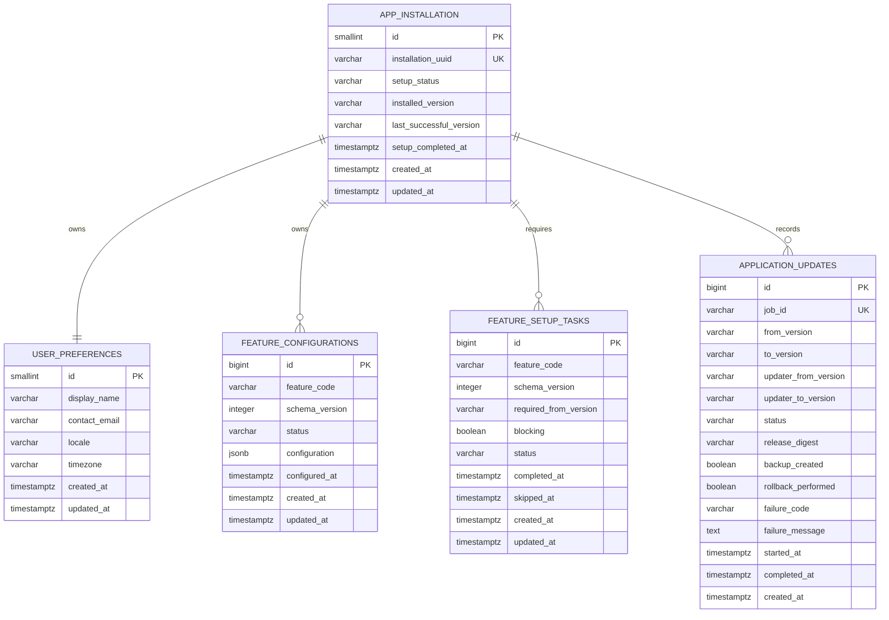

# RicercaCasa — V3 Analisi Database

**Versione documento:** 3.0  
**Data:** 14 luglio 2026  
**Branch di riferimento:** `main`  
**DBMS:** PostgreSQL 17  
**Versionamento schema:** `node-pg-migrate`

---

## 1. Obiettivo

La V3 estende il database V2 per supportare:

1. identificazione dell'installazione locale;
2. stato del wizard iniziale;
3. impostazioni generali dell'utente;
4. configurazioni versionate delle funzionalità;
5. task di configurazione dopo gli aggiornamenti;
6. storico sintetico degli aggiornamenti;
7. compatibilità con backup, migrazioni e rollback controllati.

La V3 non modifica il modello immobiliare V2 e non aggiunge nuovi provider.

Le modifiche devono essere additive e applicabili sia a:

- database nuovo;
- database V2 aggiornato con tutte le migrazioni esistenti;
- installazione Docker appena creata;
- installazione locale manuale aggiornata successivamente alla V3.

---

## 2. Principi di modellazione

### 2.1 Dati applicativi e stato dell'updater

Il database PostgreSQL conserva:

- impostazioni dell'applicazione;
- task di configurazione;
- storico leggibile degli aggiornamenti riusciti o falliti.

Lo stato operativo necessario al self-update dell'updater non deve dipendere esclusivamente da PostgreSQL.

L'updater conserva nel proprio volume persistente almeno:

- job attivo;
- fase corrente;
- manifest scaricato;
- versione precedente;
- versione obiettivo;
- retry count;
- riferimenti ai backup;
- ultimo errore tecnico.

Questo permette al nuovo container updater di riprendere il job anche se backend o database non sono temporaneamente disponibili.

### 2.2 Nessun segreto nel database generico

Non devono essere memorizzati in chiaro nelle tabelle V3:

- password PostgreSQL;
- token di bootstrap;
- password SMTP;
- API key;
- token OAuth;
- secret applicativi.

Le configurazioni JSONB non devono contenere segreti.

### 2.3 Tabelle singleton esplicite

RicercaCasa V3 resta single-user. Le impostazioni generali vengono modellate con tabelle singleton, imponendo `id = 1` tramite `CHECK`.

Questa scelta rende chiaro che non esiste ancora un modello multiutente.

### 2.4 Configurazioni future versionate

Le configurazioni delle funzionalità vengono separate dalle preferenze generali e identificate da:

```text
(feature_code, schema_version)
```

Una nuova versione dello schema di configurazione produce un nuovo task senza sovrascrivere silenziosamente la configurazione precedente.

---

## 3. Stato V2 di riferimento

Il database V2 contiene già il dominio immobiliare:

- `sources`;
- `property_groups`;
- `saved_listings`;
- `listing_images`;
- `duplicate_candidates`;
- `listing_notes`;
- `listing_appointments`;
- `scraping_runs`;
- tabella tecnica delle migrazioni.

La V3 non sposta note, appuntamenti, preferiti o fonti nelle nuove tabelle.

La migrazione più recente verificata su `main` è numerata `012`; le migrazioni V3 devono quindi proseguire senza rinumerare o modificare quelle già condivise.

---

## 4. Nuove entità V3

1. `app_installation` — identità e stato dell'installazione;
2. `user_preferences` — impostazioni generali modificabili;
3. `feature_configurations` — configurazioni non segrete delle funzionalità;
4. `feature_setup_tasks` — wizard iniziali o post-update;
5. `application_updates` — storico sintetico degli aggiornamenti.



---

## 5. Tabella `app_installation`

### 5.1 Scopo

Rappresenta l'unica installazione locale gestita dal database.

Non identifica una persona e non deve essere usata per telemetria automatica.

### 5.2 Campi

| Campo | Tipo | Null | Regole |
|---|---|---:|---|
| `id` | `SMALLINT` | no | PK, valore unico `1` |
| `installation_uuid` | `VARCHAR(36)` | no | UNIQUE, generato dall'applicazione |
| `setup_status` | `VARCHAR(20)` | no | default `pending` |
| `installed_version` | `VARCHAR(32)` | sì | versione attualmente dichiarata |
| `last_successful_version` | `VARCHAR(32)` | sì | ultima release verificata sana |
| `setup_completed_at` | `TIMESTAMPTZ` | sì | valorizzato al termine wizard |
| `created_at` | `TIMESTAMPTZ` | no | default `now()` |
| `updated_at` | `TIMESTAMPTZ` | no | default `now()` |

### 5.3 Vincoli

```sql
CHECK (id = 1)
```

```sql
CHECK (setup_status IN ('pending', 'in_progress', 'completed', 'failed'))
```

`installation_uuid` viene generato dal backend o dall'installer e non richiede estensioni PostgreSQL.

### 5.4 Regole

- Deve esistere al massimo una riga.
- Il seed deve essere idempotente.
- `installed_version` viene aggiornato soltanto dopo verifica finale della release.
- `last_successful_version` non viene modificato all'inizio di un aggiornamento.
- Un aggiornamento fallito non deve dichiarare come installata la versione obiettivo.

### 5.5 Esempio

```sql
INSERT INTO app_installation (
  id,
  installation_uuid,
  setup_status
)
VALUES (1, $1, 'pending')
ON CONFLICT (id) DO NOTHING;
```

---

## 6. Tabella `user_preferences`

### 6.1 Scopo

Conserva le impostazioni generali richieste dal wizard V3 e modificabili dalla pagina Impostazioni.

### 6.2 Campi

| Campo | Tipo | Null | Regole |
|---|---|---:|---|
| `id` | `SMALLINT` | no | PK, valore `1` |
| `display_name` | `VARCHAR(120)` | sì | nome mostrato nell'interfaccia |
| `contact_email` | `VARCHAR(320)` | sì | email futura per contatti/notifiche |
| `locale` | `VARCHAR(20)` | no | default `it-IT` |
| `timezone` | `VARCHAR(100)` | no | default `Europe/Rome` |
| `created_at` | `TIMESTAMPTZ` | no | default `now()` |
| `updated_at` | `TIMESTAMPTZ` | no | default `now()` |

### 6.3 Vincoli

```sql
CHECK (id = 1)
```

```sql
CHECK (char_length(trim(display_name)) BETWEEN 1 AND 120)
```

Il check sul nome va applicato soltanto quando il valore non è `NULL`, così la riga può essere creata prima del completamento del wizard.

L'email deve essere validata principalmente a livello applicativo. Un check SQL troppo rigido su email valide è sconsigliato.

### 6.4 Normalizzazione

- `display_name`: trim degli spazi esterni;
- `contact_email`: trim e lowercase della parte dominio; conservare con prudenza la parte locale;
- `locale`: codici supportati dall'applicazione;
- `timezone`: identificatore IANA, non offset fisso.

### 6.5 Aggiornamento

Ogni modifica deve aggiornare `updated_at` tramite query applicativa esplicita.

Non è necessario introdurre trigger.

---

## 7. Tabella `feature_configurations`

### 7.1 Scopo

Conserva configurazioni non segrete per funzionalità presenti o future.

Esempi:

- preferenze di invio email non sensibili;
- mittente visualizzato;
- comportamento notifiche;
- integrazione calendario non ancora autenticata;
- opzioni specifiche di una feature.

### 7.2 Campi

| Campo | Tipo | Null | Regole |
|---|---|---:|---|
| `id` | `BIGSERIAL` | no | PK |
| `feature_code` | `VARCHAR(100)` | no | codice stabile |
| `schema_version` | `INTEGER` | no | maggiore di zero |
| `status` | `VARCHAR(20)` | no | default `pending` |
| `configuration` | `JSONB` | no | default `{}` |
| `configured_at` | `TIMESTAMPTZ` | sì | completamento configurazione |
| `created_at` | `TIMESTAMPTZ` | no | default `now()` |
| `updated_at` | `TIMESTAMPTZ` | no | default `now()` |

### 7.3 Vincoli

```sql
UNIQUE (feature_code, schema_version)
```

```sql
CHECK (schema_version > 0)
```

```sql
CHECK (status IN ('pending', 'configured', 'disabled', 'invalid'))
```

```sql
CHECK (jsonb_typeof(configuration) = 'object')
```

### 7.4 Indici

```sql
CREATE INDEX feature_configurations_status_idx
ON feature_configurations (status);
```

Un indice GIN su `configuration` non deve essere creato finché non esistono query reali che lo richiedono.

### 7.5 Regole di validazione

Il database garantisce soltanto struttura generale e unicità.

Ogni feature deve avere un validator applicativo specifico per:

- campi ammessi;
- tipo;
- lunghezza;
- obbligatorietà;
- compatibilità con `schema_version`;
- assenza di chiavi segrete.

### 7.6 Segreti

Esempio futuro per SMTP:

```json
{
  "fromName": "Giorgio",
  "fromEmail": "info@example.it",
  "host": "smtp.example.it",
  "port": 587,
  "secure": false,
  "username": "info@example.it",
  "passwordConfigured": true
}
```

La password reale non deve essere presente nel JSON. Deve essere salvata in uno storage secret dedicato e referenziata soltanto internamente.

---

## 8. Tabella `feature_setup_tasks`

### 8.1 Scopo

Determina quali wizard devono essere mostrati dopo l'installazione o un aggiornamento.

### 8.2 Campi

| Campo | Tipo | Null | Regole |
|---|---|---:|---|
| `id` | `BIGSERIAL` | no | PK |
| `feature_code` | `VARCHAR(100)` | no | codice feature |
| `schema_version` | `INTEGER` | no | versione configurazione richiesta |
| `required_from_version` | `VARCHAR(32)` | no | release che introduce il task |
| `blocking` | `BOOLEAN` | no | default `false` |
| `status` | `VARCHAR(20)` | no | default `pending` |
| `completed_at` | `TIMESTAMPTZ` | sì | task completato |
| `skipped_at` | `TIMESTAMPTZ` | sì | task non bloccante saltato |
| `created_at` | `TIMESTAMPTZ` | no | default `now()` |
| `updated_at` | `TIMESTAMPTZ` | no | default `now()` |

### 8.3 Vincoli

```sql
UNIQUE (feature_code, schema_version)
```

```sql
CHECK (schema_version > 0)
```

```sql
CHECK (status IN ('pending', 'in_progress', 'completed', 'skipped', 'failed'))
```

```sql
CHECK (NOT blocking OR status <> 'skipped')
```

### 8.4 Regole

- Un task bloccante non può essere saltato.
- Un task completato non viene riproposto per la stessa `schema_version`.
- Una nuova `schema_version` crea un nuovo task.
- La configurazione viene salvata in `feature_configurations`, non nella riga del task.
- Il task può esistere prima della configurazione.

### 8.5 Inserimento idempotente da migrazione

```sql
INSERT INTO feature_setup_tasks (
  feature_code,
  schema_version,
  required_from_version,
  blocking,
  status
)
VALUES ('email_delivery', 1, '4.1.0', false, 'pending')
ON CONFLICT (feature_code, schema_version) DO NOTHING;
```

La V3 iniziale non deve creare il task SMTP se la feature non è ancora implementata.

---

## 9. Tabella `application_updates`

### 9.1 Scopo

Conserva uno storico sintetico e leggibile dalla dashboard.

Non sostituisce i log completi dell'updater e non è il solo storage del job attivo.

### 9.2 Campi

| Campo | Tipo | Null | Regole |
|---|---|---:|---|
| `id` | `BIGSERIAL` | no | PK |
| `job_id` | `VARCHAR(100)` | no | UNIQUE |
| `from_version` | `VARCHAR(32)` | sì | versione iniziale |
| `to_version` | `VARCHAR(32)` | no | versione richiesta |
| `updater_from_version` | `VARCHAR(32)` | sì | updater iniziale |
| `updater_to_version` | `VARCHAR(32)` | sì | updater finale/richiesto |
| `status` | `VARCHAR(20)` | no | stato finale o in corso |
| `release_digest` | `VARCHAR(128)` | sì | hash manifest/release |
| `backup_created` | `BOOLEAN` | no | default `false` |
| `rollback_performed` | `BOOLEAN` | no | default `false` |
| `failure_code` | `VARCHAR(100)` | sì | codice tecnico stabile |
| `failure_message` | `TEXT` | sì | messaggio senza segreti |
| `started_at` | `TIMESTAMPTZ` | no | inizio job |
| `completed_at` | `TIMESTAMPTZ` | sì | fine job |
| `created_at` | `TIMESTAMPTZ` | no | default `now()` |

### 9.3 Vincoli

```sql
CHECK (status IN ('pending', 'running', 'succeeded', 'failed', 'rolled_back', 'cancelled'))
```

### 9.4 Indici

```sql
CREATE INDEX application_updates_started_at_idx
ON application_updates (started_at DESC);
```

```sql
CREATE INDEX application_updates_status_idx
ON application_updates (status);
```

### 9.5 Privacy e log

`failure_message` non deve contenere:

- password;
- token;
- URL con credenziali;
- dump di variabili ambiente;
- contenuto dei secret.

I log tecnici completi restano nel volume dell'updater con politica di rotazione.

---

## 10. Relazioni con il wizard

### 10.1 Prima installazione

Sequenza:

1. migrazione crea `app_installation` e `user_preferences`;
2. viene inserita la riga singleton con setup `pending`;
3. il wizard raccoglie nome, email, lingua e timezone;
4. il backend aggiorna `user_preferences` in transazione;
5. il backend imposta `app_installation.setup_status = 'completed'`;
6. viene valorizzato `setup_completed_at`.

### 10.2 Transazione di completamento

Il completamento deve essere atomico:

```text
BEGIN
  UPDATE user_preferences
  UPDATE app_installation
COMMIT
```

Se una validazione fallisce, il setup resta incompleto.

### 10.3 Wizard post-update

Sequenza:

1. la migrazione o il service di release inserisce il task idempotente;
2. il backend restituisce i task `pending`;
3. l'updater presenta il wizard;
4. il backend valida e salva `feature_configurations`;
5. il task diventa `completed`;
6. la feature viene abilitata.

Configurazione e completamento task devono avvenire nella stessa transazione quando possibile.

---

## 11. Versioni applicative

### 11.1 Formato

Usare SemVer:

```text
MAJOR.MINOR.PATCH
```

Esempi validi:

- `3.0.0`;
- `3.1.0`;
- `3.1.1`.

### 11.2 Confronto

Il database conserva le versioni come stringhe. Il confronto SemVer deve avvenire nell'applicazione, non con ordinamento lessicografico SQL.

### 11.3 Fonte di verità

Durante un aggiornamento:

- il release manifest definisce la versione obiettivo;
- l'updater mantiene lo stato operativo;
- `app_installation.installed_version` viene aggiornato soltanto dopo esito positivo;
- `last_successful_version` resta disponibile per rollback e diagnostica.

---

## 12. Piano migrazioni V3

Numerazione proposta, da verificare immediatamente prima dell'implementazione:

```text
013_create_app_installation.js
014_create_user_preferences.js
015_create_feature_configurations.js
016_create_feature_setup_tasks.js
017_create_application_updates.js
```

### 12.1 Migrazione 013

- crea `app_installation`;
- inserisce riga singleton se assente;
- non imposta automaticamente setup completato;
- non inventa la versione installata.

### 12.2 Migrazione 014

- crea `user_preferences`;
- inserisce riga singleton vuota con locale e timezone di default;
- non richiede subito nome/email per consentire il wizard.

### 12.3 Migrazione 015

- crea `feature_configurations`;
- aggiunge vincoli e indice stato;
- non inserisce feature non implementate.

### 12.4 Migrazione 016

- crea `feature_setup_tasks`;
- non crea task SMTP nella V3;
- può creare un task di conferma setup soltanto se realmente necessario.

### 12.5 Migrazione 017

- crea `application_updates`;
- non importa retroattivamente aggiornamenti non tracciati.

### 12.6 Rollback

I `down` devono essere disponibili in sviluppo, ma la procedura production non deve eseguire automaticamente rollback dello schema senza una dichiarazione esplicita della release.

Prima di rimuovere tabelle V3, il rollback deve verificare che la versione applicativa precedente non le utilizzi.

---

## 13. Backup e ripristino

### 13.1 Formato consigliato

Usare dump PostgreSQL custom format:

```text
pg_dump --format=custom
```

Vantaggi:

- controllo integrità;
- ripristino selettivo;
- compressione;
- uso con `pg_restore`.

### 13.2 Metadati esterni

Accanto al dump, l'updater salva un file metadata:

```json
{
  "createdAt": "2026-07-14T18:00:00Z",
  "fromVersion": "3.0.0",
  "targetVersion": "3.1.0",
  "postgresMajor": 17,
  "sha256": "...",
  "verified": true
}
```

Il percorso reale non deve essere salvato come dato necessario nel database, perché può cambiare tra host.

### 13.3 Verifica

Un backup è valido soltanto se:

- `pg_dump` termina con exit code zero;
- il file non è vuoto;
- viene calcolato il checksum;
- `pg_restore --list` riesce;
- i metadati sono scritti correttamente.

### 13.4 Ripristino

Il ripristino production deve essere un'azione esplicita, protetta e documentata. Non deve essere eseguito automaticamente dopo qualsiasi errore minore.

---

## 14. Query applicative principali

### 14.1 Stato setup

```sql
SELECT
  ai.setup_status,
  ai.installed_version,
  ai.last_successful_version,
  ai.setup_completed_at,
  up.display_name,
  up.contact_email,
  up.locale,
  up.timezone
FROM app_installation ai
JOIN user_preferences up ON up.id = ai.id
WHERE ai.id = 1;
```

### 14.2 Task pendenti

```sql
SELECT
  feature_code,
  schema_version,
  required_from_version,
  blocking,
  status
FROM feature_setup_tasks
WHERE status IN ('pending', 'in_progress', 'failed')
ORDER BY blocking DESC, id ASC;
```

### 14.3 Informazioni feature

```sql
SELECT
  fc.feature_code,
  fc.schema_version,
  fc.status,
  fc.configuration,
  fst.status AS setup_status,
  fst.blocking
FROM feature_configurations fc
LEFT JOIN feature_setup_tasks fst
  ON fst.feature_code = fc.feature_code
 AND fst.schema_version = fc.schema_version
ORDER BY fc.feature_code, fc.schema_version DESC;
```

### 14.4 Ultimo aggiornamento riuscito

```sql
SELECT *
FROM application_updates
WHERE status = 'succeeded'
ORDER BY completed_at DESC
LIMIT 1;
```

---

## 15. Concorrenza e consistenza

### 15.1 Un solo job attivo

L'updater deve impedire più job concorrenti nel proprio volume.

Come difesa aggiuntiva, il database può usare un advisory lock durante le scritture di aggiornamento:

```sql
SELECT pg_try_advisory_lock($1);
```

Il lock database non sostituisce il lock persistente dell'updater.

### 15.2 Aggiornamento versione

L'aggiornamento finale deve avvenire in transazione:

1. aggiornare o inserire `application_updates`;
2. impostare `installed_version`;
3. impostare `last_successful_version`;
4. commit.

### 15.3 Task feature

Non deve essere possibile marcare un task `completed` se la configurazione specifica non supera il validator della feature.

---

## 16. API e repository

Repository backend suggeriti:

```text
backend/repositories/
├── installationRepository.js
├── userPreferencesRepository.js
├── featureConfigurationRepository.js
├── featureSetupTaskRepository.js
└── applicationUpdateRepository.js
```

Service suggeriti:

```text
backend/services/
├── setupService.js
├── settingsService.js
├── featureConfigurationService.js
└── systemInfoService.js
```

Regole:

- i controller non eseguono SQL;
- i repository non validano SemVer;
- i repository non conoscono Docker;
- l'updater non scrive direttamente dati di business saltando il backend, salvo lo storico tecnico concordato;
- ogni query usa parametri;
- ogni configurazione viene validata prima del salvataggio.

---

## 17. Test database obbligatori

### 17.1 Database vuoto

- applicazione di tutte le migrazioni da zero;
- presenza di una sola riga singleton;
- default corretti;
- vincoli attivi.

### 17.2 Upgrade V2 → V3

- preservazione di tutti gli immobili;
- preservazione di note e appuntamenti;
- nessuna modifica ai provider;
- creazione delle tabelle V3;
- setup `pending` oppure stato esplicitamente migrato secondo la procedura scelta.

### 17.3 Idempotenza

- seed ripetuti non duplicano singleton o task;
- stessa feature/schema non viene duplicata;
- stesso `job_id` non viene duplicato.

### 17.4 Vincoli

Verificare il rifiuto di:

- più righe singleton;
- schema version zero o negativo;
- status non ammessi;
- configurazione JSON non oggetto;
- task bloccante saltato;
- job update duplicato.

### 17.5 Transazioni

- errore durante setup non completa installazione;
- errore configurazione non completa task;
- errore finalizzazione update non modifica `last_successful_version`.

### 17.6 Backup/restore

Test end-to-end:

1. creare dati V2/V3;
2. produrre dump;
3. eliminare database di test;
4. ripristinare;
5. verificare conteggi e relazioni;
6. avviare backend e controllare readiness.

---

## 18. Decisioni finali V3

- Le tabelle immobiliari V2 restano invariate.
- La V3 introduce impostazioni e setup, non multiutenza.
- Nome ed email appartengono a `user_preferences`.
- Le configurazioni future sono versionate per feature.
- I segreti non vengono salvati nel JSONB.
- I task di configurazione sono separati dai dati configurati.
- Lo storico aggiornamenti PostgreSQL è consultivo.
- Lo stato necessario al self-update vive anche nel volume updater.
- `installed_version` viene aggiornato solo dopo healthcheck riusciti.
- Le migrazioni V3 proseguono dopo la numerazione esistente e non modificano file già pubblicati.
